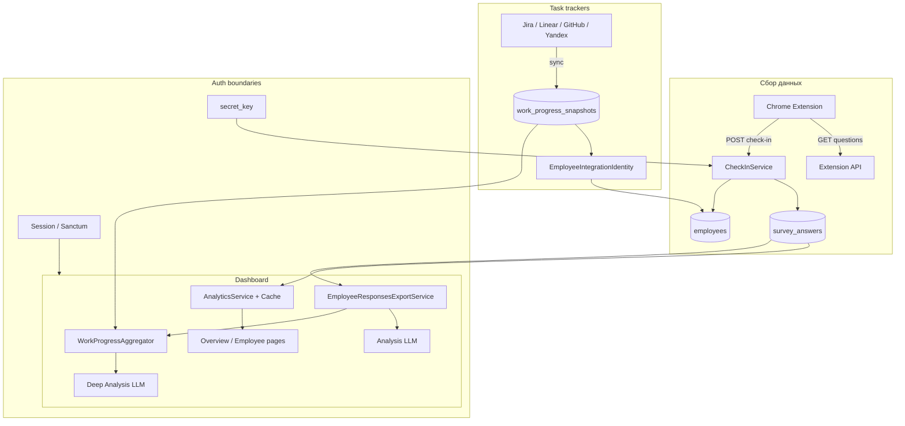

# Wellbeing Monitor — end-to-end описание системы

Документ описывает, как система работает от сбора данных до LLM-рекомендаций и интеграций с трекерами задач. Цель — понять границы проекта и спланировать интеграцию с **производственными метриками**.

---

## 1. Что это за система и где её границы

**Wellbeing Monitor** — MVP-платформа для ежедневного мониторинга психологического состояния удалённых сотрудников.

| В scope (реализовано) | Вне scope / заглушки |
|----------------------|----------------------|
| Сбор check-in через Chrome-расширение | SSO, OAuth для dashboard |
| Web-dashboard (Blade + Chart.js) | Отдельный SPA-фронтенд |
| REST API v1 | Микросервисное разделение |
| PostgreSQL как основное хранилище | Pre-aggregated analytics tables |
| Redis (сессии, кэш, очереди) | Полноценная биллинг-система |
| LLM-анализ wellbeing | Жёсткий лимит LLM-запросов (в config есть, не enforced) |
| Интеграции с **task trackers** (Jira, Linear, GitHub, Яндекс Трекер) | **Производственные метрики** (CI/CD, deploy frequency, incident rate и т.п.) — **не реализованы** |

**Ключевая идея:** wellbeing-данные и task-метрики живут в разных слоях и сходятся только на этапе **Deep Analysis** через JSON-снимки.

---

## 2. Компоненты и инфраструктура

```
┌──────────────────────┐
│ Chrome Extension MV3 │  Vanilla JS, без сборки
│ popup + options +  │  local storage (настройки)
│ service worker     │
└──────────┬───────────┘
           │ HTTPS JSON
           │ secret_key (48 chars)
           ▼
┌──────────────────────┐     ┌─────────────┐
│ Nginx :8080          │────▶│ PHP-FPM     │
│ /var/www/backend     │     │ Laravel 12  │
└──────────────────────┘     └──────┬──────┘
                                    │
              ┌─────────────────────┼─────────────────────┐
              ▼                     ▼                     ▼
        ┌──────────┐          ┌──────────┐         ┌──────────┐
        │PostgreSQL│          │  Redis   │         │ External │
        │ wellbeing│          │ cache/   │         │ APIs:    │
        │          │          │ queue/   │         │ Jira,    │
        └──────────┘          │ session  │         │ Linear,  │
                              └──────────┘         │ GitHub,  │
                                                   │ Yandex,  │
                                                   │ Gemini   │
                                                   └──────────┘

Фоновые процессы:
  queue      → php artisan queue:work redis
  scheduler  → schedule:run каждые 60 сек
```

### Docker-сервисы

| Сервис | Контейнер | Роль |
|--------|-----------|------|
| `nginx` | `wellbeing_nginx` | Reverse proxy, `public/` Laravel, порт `${APP_PORT:-8080}` |
| `app` | `wellbeing_app` | PHP-FPM, Laravel |
| `postgres` | `wellbeing_postgres` | PostgreSQL 16, БД `wellbeing` |
| `redis` | `wellbeing_redis` | Cache, queue, sessions |
| `queue` | `wellbeing_queue` | `php artisan queue:work redis` |
| `scheduler` | `wellbeing_scheduler` | `schedule:run` каждые 60 сек |

**Сеть:** все сервисы в `wellbeing_net` (bridge).

**Volumes:**
- `./backend` — код приложения
- `wellbeing_vendor` — Composer dependencies
- `postgres_data`, `redis_data` — persistent data

**Важно про порты БД:**
- Laravel **внутри Docker** подключается к `postgres:5432`
- `DB_PORT=5433` в корневом `.env` — только проброс на хост (TablePlus, psql с Mac)
- В `backend/.env` для контейнера должно быть `DB_PORT=5432`

---

## 3. Модель данных (PostgreSQL)

### 3.1 Ядро wellbeing

```
companies
  id, name, secret_key (48 символов, unique)

users
  id, company_id (legacy), email, password, role (admin|hr|manager)

company_user                    ← many-to-many пользователь ↔ компания
  user_id, company_id, role

departments
  company_id, name, external_id   unique(company_id, external_id)

employees
  company_id, department_id, external_id, email, name
  unique(company_id, external_id)

surveys
  company_id (nullable), title, is_active
  company_id=null → глобальный опрос по умолчанию

survey_questions
  survey_id, question, type (scale|boolean|text), sort_order, options (JSON)

survey_answers                  ← основное хранилище check-in
  company_id, employee_id, survey_question_id,
  answer, score, check_in_date
```

### 3.2 Интеграции (task trackers)

```
integration_providers           ← справочник (Jira, Linear, …)
  slug, name, auth_type, config_schema

company_integrations            ← подключение компании к провайдеру
  company_id, provider_slug, status, credentials (encrypted),
  settings, last_sync_at, last_error

employee_integration_identities ← маппинг сотрудник ↔ пользователь трекера
  employee_id, company_integration_id, external_user_id, external_login, external_email

work_progress_snapshots         ← снимок метрик задач за период
  company_id, provider_slug, period_from, period_to,
  payload (JSON), fetched_at
  unique(company_id, provider_slug, period_from, period_to)
```

### 3.3 Связи Eloquent

```
Company ─┬─ hasMany → Employee, Department, SurveyAnswer, CompanyIntegration, WorkProgressSnapshot
         └─ belongsToMany → User (через company_user)

User ─┬─ belongsTo → Company (legacy company_id)
      └─ belongsToMany → Company (pivot: role)

Employee ─ hasMany → SurveyAnswer, EmployeeIntegrationIdentity
Survey ─ hasMany → SurveyQuestion ─ hasMany → SurveyAnswer
```

---

## 4. Поток 1: Сбор wellbeing-данных (расширение → БД)

### 4.1 Настройка расширения

Сотрудник в **Options** сохраняет в `chrome.storage.local`:

| Ключ | Назначение |
|------|------------|
| `apiBaseUrl` | `http://localhost:8080/api/v1/extension` |
| `secretKey` | 48-символьный ключ компании |
| `employeeExternalId` | `emp-001` или auto-generated `emp-{uuid}` |
| `employeeEmail`, `employeeName` | опционально |
| `lastCheckInDates` | `{ "emp-001": "2026-05-29" }` — локально, не на сервере |
| `reminderHour` | час ежедневного напоминания (0–23) |

**Background service worker:**
- При install генерирует `employeeExternalId`, если пустой
- Daily alarm → Chrome notification, если check-in сегодня не был
- На save options → `RESCHEDULE_REMINDER`

### 4.2 Получение вопросов

```http
GET /api/v1/extension/survey/questions?secret_key={48chars}
```

Rate limit: **30 req/min** по IP.

**Backend:**
1. `CompanyRepository::findBySecretKey`
2. `SurveyRepository::getActiveQuestionsForCompany` — company-specific опрос или глобальный
3. Возвращает массив вопросов

**Пример ответа:**

```json
{
  "data": [
    {
      "id": 1,
      "question": "How would you rate your overall mood today?",
      "type": "scale",
      "sort_order": 1,
      "options": { "min": 1, "max": 5, "labels": ["Very low", "Low", "Neutral", "Good", "Excellent"] }
    },
    {
      "id": 3,
      "question": "Did you feel supported by your team today?",
      "type": "boolean",
      "sort_order": 3,
      "options": null
    }
  ]
}
```

**Данные на этом этапе:** только конфигурация опроса, ответов ещё нет.

### 4.3 Отправка check-in

```http
POST /api/v1/extension/check-in
Content-Type: application/json
```

**Тело запроса:**

```json
{
  "secret_key": "demo_secret_key_12345678901234567890123456789012",
  "employee": {
    "external_id": "emp-001",
    "email": "alice@acme.test",
    "name": "Alice Johnson"
  },
  "answers": [
    { "question_id": 1, "answer": "4" },
    { "question_id": 2, "answer": "2" },
    { "question_id": 3, "answer": "yes" },
    { "question_id": 4, "answer": "Good day overall" }
  ]
}
```

**Backend (`CheckInService`):**

```
secret_key → Company
employee → upsert Employee (по company_id + external_id)
validate answers → против активных question_id
storeAnswers → survey_answers (с расчётом score)
dispatch ProcessCheckInAnalyticsJob  ← сейчас пустая заглушка
return { company_id, employee_id, check_in_date, answers_stored }
```

**Scoring (`AnswerScoreCalculator`):**
- `scale` → число 1–5 как score
- `boolean` → yes=5.0, no=1.0
- `text` → score = null

**Дата check-in:** `now()->toDateString()`.

**Ответ (201):**

```json
{
  "message": "Check-in submitted successfully.",
  "data": {
    "company_id": 1,
    "employee_id": 1,
    "check_in_date": "2026-05-29",
    "answers_stored": 4
  }
}
```

**Данные после этапа:** строки в `survey_answers`, upsert в `employees`.

---

## 5. Поток 2: Dashboard — просмотр и аналитика

### 5.1 Аутентификация и multi-tenant

| Канал | Механизм |
|-------|----------|
| Web (Blade) | Session auth (Redis) |
| API | Sanctum bearer token (`POST /api/v1/dashboard/auth/login`) |
| Extension | `secret_key` (не Sanctum) |

**Контекст компании:**
- Пользователь может быть в нескольких компаниях (`company_user`)
- Активная компания — session `active_company_id` (`ActiveCompanyService`)
- Middleware `company` требует хотя бы одну компанию в pivot-таблице

**Onboarding нового пользователя:**

```
/register → User без company
/onboarding/company → CompanyOnboardingService
  → создаёт Company (+ auto secret_key)
  → attach company_user
  → set active company
```

### 5.2 Dashboard Overview (`/dashboard`)

```
AnalyticsController → AnalyticsService::getOverview(companyId, from, to)
  → AnalyticsRepository (SQL агрегации по survey_answers)
  → BurnoutRiskService (7 дней vs предыдущие 7 дней)
  → Cache Redis, TTL 300 сек
```

**Метрики на UI:**

| Метрика | Источник |
|---------|----------|
| Средний mood score | AVG score по scorable answers |
| Burnout risk (low/medium/high) | Сравнение двух 7-дневных окон |
| Trend by date | Группировка по `check_in_date` |
| Department overview | JOIN employees → departments |
| Employee summaries | Группировка по employee |
| Weekly summary | Агрегат за период |

**Структура `$overview`:**

```javascript
{
  average_mood_score: 3.42,
  burnout_risk: { level, label, current_average, previous_average, trend },
  trends: [{ date, average_score, responses }],
  weekly_summary: { period_from, period_to, average_score, total_responses, active_days },
  department_overview: [{ department_id, department_name, average_score, employees }],
  employee_summaries: [{ employee_id, name, average_score, responses }]
}
```

**Данные на этом этапе:** только `survey_answers` + справочники. Task trackers **не участвуют**.

### 5.3 Employee detail (`/dashboard/employees/{id}`)

История по дням:

```javascript
{
  employee_id,
  history: [{ date, average_score, answers: [{ question, answer, score }] }],
  burnout_risk: { level, label, current_average, previous_average, trend }
}
```

### 5.4 Страницы dashboard

| Страница | Route | Назначение |
|----------|-------|------------|
| Overview | `/dashboard` | KPI, графики, таблица сотрудников |
| Employee | `/dashboard/employees/{id}` | Детальная история check-in |
| Analysis | `/dashboard/analysis` | LLM-рекомендации по wellbeing |
| Deep Analysis | `/dashboard/deep-analysis` | Wellbeing + task metrics → LLM |
| Integrations | `/dashboard/integrations` | Подключение трекеров задач |
| Companies | `/companies` | Multi-company switch |

---

## 6. Поток 3: LLM Analysis (только wellbeing)

```
/dashboard/analysis
  → выбор сценария (psychologist | hr_analyst | business_consultant)
  → выбор периода (from/to или 7/14/30 дней)
  → POST /dashboard/analysis/recommend
```

**Pipeline:**

```
1. EmployeeResponsesExportService::exportForCompany()
   survey_answers → JSON

2. AnalysisPromptCatalog → system prompt
3. LlmAnalysisService → POST /chat/completions (Gemini/OpenAI-compatible)
4. normalizeRecommendation() → нумерованный список рекомендаций
5. JSON response → UI
```

**Формат export JSON:**

```json
{
  "company": { "id": 1, "name": "Acme Remote Corp" },
  "period": { "from": "2026-05-23", "to": "2026-05-29" },
  "summary": {
    "total_answers": 42,
    "employees_count": 3,
    "days_with_data": 7
  },
  "employees": [{
    "external_id": "emp-001",
    "name": "Alice Johnson",
    "email": "alice@acme.test",
    "department": "Engineering",
    "check_ins": [{
      "date": "2026-05-29",
      "answers": [
        { "question": "...", "type": "scale", "answer": "4", "score": 4.0 }
      ]
    }]
  }]
}
```

**Промпты:** `config/analysis_prompts.php` — psychologist, hr_analyst, business_consultant.

**LLM config:** `config/llm.php` + `OPENAI_*` env vars (совместимость с Gemini через OpenAI endpoint).

**Данные на вход LLM:** только wellbeing JSON. Производственных метрик нет.

---

## 7. Поток 4: Интеграции с task trackers

### 7.1 Подключение (`/dashboard/integrations`)

```http
POST /dashboard/integrations/{provider}
DELETE /dashboard/integrations/{provider}
POST /dashboard/integrations/{provider}/test
```

Credentials сохраняются **encrypted** в `company_integrations`.

**Провайдеры (реализованы):**

| slug | Название | Auth |
|------|----------|------|
| `jira` | Jira Cloud | basic (email + API token) |
| `linear` | Linear | API key |
| `github` | GitHub Issues | PAT |
| `yandex_tracker` | Яндекс Трекер | OAuth token + org_id |

Конфигурация полей: `config/integrations.php`.

### 7.2 Синхронизация

```
DeepAnalysisController@sync
  или
DeepAnalysisController@recommend (sync_first=true)

IntegrationManager::syncWorkProgress(companyId, from, to, providers[])
```

**Шаги:**

1. `Connector.fetchWorkProgress(from, to, credentials)` — запрос issues/tasks
2. `IssueProgressAggregator` — метрики по assignee
3. `WorkProgressSnapshot::updateOrCreate` — сохранение JSON snapshot
4. `syncEmployeeIdentities` — match tracker email/login → Employee

**Структура snapshot payload:**

```json
{
  "provider": "jira",
  "team_summary": {
    "tasks_closed": 12,
    "overdue": 3,
    "tasks_open": 45,
    "contributors": 5
  },
  "employees": [{
    "assignee_key": "alice@acme.test",
    "display_name": "Alice Johnson",
    "external_email": "alice@acme.test",
    "tasks_closed": 4,
    "tasks_created": 2,
    "tasks_updated": 6,
    "tasks_open_at_period_end": 3,
    "overdue_count": 1,
    "by_status": { "Done": 4, "In Progress": 2 },
    "sample_issues": []
  }],
  "warnings": []
}
```

**Маппинг на wellbeing-сотрудников (`WorkProgressAggregator::mergeForCompany`):**

```json
{
  "sources": ["jira"],
  "team_summary": { "tasks_closed": 12, "overdue": 3 },
  "employees": [{
    "employee_id": 1,
    "name": "Alice Johnson",
    "email": "alice@acme.test",
    "wellbeing_linked": true,
    "providers": {
      "jira": { "tasks_closed": 4, "overdue_count": 1 }
    }
  }],
  "warnings": []
}
```

**Приоритет маппинга:**
1. `employee_integration_identities` (external_login / external_user_id)
2. Fallback: совпадение email

---

## 8. Поток 5: Deep Analysis (wellbeing + task metrics → LLM)

```
/dashboard/deep-analysis
  → выбор интеграций (checkboxes)
  → Sync → fetch из трекеров → work_progress_snapshots
  → Preview → JSON preview
  → Recommend → LLM
```

**DeepAnalysisExportService::build():**

```json
{
  "company": { "id": 1, "name": "Acme Remote Corp" },
  "period": { "from": "2026-05-23", "to": "2026-05-29" },
  "wellbeing": { "...": "формат как в Analysis export" },
  "work_progress": {
    "sources": ["jira"],
    "team_summary": { "tasks_closed": 12, "overdue": 3 },
    "employees": [{ "employee_id": 1, "wellbeing_linked": true, "providers": {} }]
  },
  "integration_warnings": []
}
```

**LLM:** `LlmAnalysisService::analyzeCombined()` + промпты из `config/deep_analysis_prompts.php`:
- `product_owner`
- `hr_delivery`
- `team_lead`

**Gating:** `PlanLimitService::can($companyId, 'deep_analysis')` — в default plan всегда `true`.

---

## 9. Полная карта потоков данных



---

## 10. Что доступно на каждом этапе

| Этап | Данные | Формат | Кто видит |
|------|--------|--------|-----------|
| Extension options | secret_key, employee_id | local storage | только браузер |
| GET questions | survey config | JSON API | extension |
| POST check-in | raw answers | → PostgreSQL rows | backend |
| PostgreSQL | survey_answers, employees | relational | backend |
| Dashboard overview | агрегаты mood, burnout, trends | PHP arrays → Blade/Chart.js | HR/Admin |
| Analysis export | employee/day answers JSON | JSON (API + UI) | HR/Admin |
| Integration sync | task metrics snapshot | JSON in `work_progress_snapshots.payload` | backend |
| Deep export | wellbeing + work_progress merged | JSON | HR/Admin |
| LLM output | текстовые рекомендации | plain text list | HR/Admin |

---

## 11. API endpoints (сводка)

### Extension API

| Method | Path | Auth |
|--------|------|------|
| GET | `/api/v1/extension/survey/questions` | `secret_key` query |
| POST | `/api/v1/extension/check-in` | `secret_key` body |

### Dashboard API

| Method | Path | Auth |
|--------|------|------|
| POST | `/api/v1/dashboard/auth/login` | — |
| POST | `/api/v1/dashboard/auth/logout` | Sanctum |
| GET | `/api/v1/dashboard/auth/me` | Sanctum |
| GET | `/api/v1/dashboard/analytics/overview` | Sanctum + company |
| GET | `/api/v1/dashboard/analytics/employees/{id}/history` | Sanctum + company |
| GET | `/api/v1/dashboard/analysis/responses` | Sanctum + company |

### Web routes (session auth)

См. `backend/routes/web.php` — dashboard, analysis, deep-analysis, integrations, companies, onboarding.

---

## 12. Слои backend-кода

### Services

| Service | Назначение |
|---------|------------|
| `CheckInService` | Extension check-in pipeline |
| `AnalyticsService` | Dashboard overview + cache |
| `BurnoutRiskService` | Risk level calculation |
| `AnswerScoreCalculator` | Score из ответов |
| `EmployeeResponsesExportService` | JSON export для LLM |
| `DeepAnalysisExportService` | Merge wellbeing + work progress |
| `LlmAnalysisService` | OpenAI-compatible LLM calls |
| `ActiveCompanyService` | Multi-company session context |
| `CompanyOnboardingService` | Создание компании при onboarding |
| `PlanLimitService` | Feature gating (deep_analysis) |

### Repositories

`CompanyRepository`, `EmployeeRepository`, `DepartmentRepository`, `SurveyRepository`, `SurveyAnswerRepository`, `AnalyticsRepository`.

### Integrations

| Класс | Назначение |
|-------|------------|
| `IntegrationManager` | Sync orchestration |
| `IntegrationRegistry` | slug → connector class |
| `WorkProgressAggregator` | Merge snapshots + employee mapping |
| `*Connector` | Jira, Linear, GitHub, Yandex Tracker |

### Jobs

| Job | Статус |
|-----|--------|
| `ProcessCheckInAnalyticsJob` | Заглушка (пустой handler) |
| `GenerateWeeklySummaryJob` | Scheduled weekly, логирует summary |

---

## 13. Очереди, кэш, фоновые задачи

| Механизм | Использование | Статус |
|----------|---------------|--------|
| Redis cache | Analytics overview, TTL 300s | Работает |
| Redis queue | Jobs после check-in | Работает (handler — заглушка) |
| Redis sessions | Web auth | Работает |
| Scheduler | Weekly summary job | Минимально |

**Env defaults:**

```
QUEUE_CONNECTION=redis
CACHE_STORE=redis
SESSION_DRIVER=redis
REDIS_HOST=redis
```

---

## 14. Безопасность и изоляция

- **Multi-tenant:** все dashboard-запросы фильтруются по `company_id`
- **Extension auth:** только `secret_key`, без user account
- **Credentials интеграций:** encrypted cast
- **Rate limits:** extension 30/min, login 5/min, LLM recommend 10/min
- **CORS:** `chrome-extension://*` разрешён

---

## 15. Enums и бизнес-правила

| Enum | Значения |
|------|----------|
| `UserRole` | admin, hr, manager |
| `QuestionType` | scale, boolean, text |
| `BurnoutRiskLevel` | low, medium, high |
| `IntegrationStatus` | disconnected, connected, error |

**Burnout risk:** сравнение avg score за последние 7 дней vs предыдущие 7 дней.

**Active survey:** company-specific preferred над global (`company_id = null`).

---

## 16. Демо-данные

| Сущность | Значение |
|----------|----------|
| Admin | `admin@acme.test` / `password` |
| HR | `hr@acme.test` / `password` |
| Company | Acme Remote Corp |
| secret_key | `demo_secret_key_12345678901234567890123456789012` |
| Employees | `emp-001`, `emp-002`, `emp-003` |
| Demo answers | 14 дней истории (после `db:seed`) |

**Команды:**

```bash
make setup
# или
docker compose up -d
docker compose exec app php artisan migrate --force
docker compose exec app php artisan db:seed --force
cd backend && npm install && npm run build
```

---

## 17. Границы проекта для интеграции производственных метрик

### Что уже есть (можно переиспользовать)

1. **Паттерн интеграций:** Provider → Connector → Snapshot
2. **Периодическая синхронизация** с ключом `(company, provider, from, to)`
3. **Маппинг сотрудников** через `EmployeeIntegrationIdentity` + email fallback
4. **Deep Analysis merge** — объединение JSON перед LLM
5. **UI** для подключения интеграций и выбора провайдеров

### Чего нет

| Производственная метрика | Статус |
|--------------------------|--------|
| Deploy frequency | ❌ |
| CI/CD pipeline status | ❌ |
| Incident count / MTTR | ❌ |
| Code review metrics | ❌ |
| Production uptime / SLO | ❌ |
| Custom KPI feed | ❌ |

Task metrics (closed/created/overdue) — **частично** через Jira/Linear/GitHub/Yandex.

### Рекомендуемые точки расширения

**Вариант A — новые провайдеры в существующем паттерне:**

```
config/integrations.php → gitlab_ci, github_actions, datadog, custom_webhook
app/Integrations/Connectors/ → новые connector classes
work_progress_snapshots → расширить payload или новая таблица
```

**Вариант B — отдельный слой метрик:**

```
production_metrics_snapshots (company_id, source_slug, period, payload JSON)
DeepAnalysisExportService → блок production_metrics
MetricsAggregator → обобщение WorkProgressAggregator
```

**Вариант C — webhook ingestion:**

```
POST /api/v1/integrations/{company}/metrics/webhook
HMAC auth → store events → aggregate by period
```

### Критичные зависимости для корреляции wellbeing ↔ production

1. **Общий ключ сотрудника** — `employees.external_id` + email
2. **Общий временной период** — `AnalysisPeriodResolver`
3. **Team-level metrics** — `team_summary` в snapshots
4. **Employee-level metrics** — маппинг как в task trackers

**Единая точка склейки для LLM:** `DeepAnalysisExportService` — сюда подключать производственные метрики.

---

## 18. Краткий вывод

1. **Wellbeing pipeline** замкнут: extension → PostgreSQL → dashboard → LLM.
2. **Task metrics pipeline** замкнут: external tracker → snapshot → merge → Deep LLM.
3. **Production metrics** архитектурно близки к task trackers, но **не реализованы**.
4. **ProcessCheckInAnalyticsJob** — место для real-time pre-aggregation (сейчас пустой).
5. Для planning интеграции с production metrics начинать с `DeepAnalysisExportService` + новых connectors.

---

## Связанные файлы в репозитории

| Область | Путь |
|---------|------|
| Extension | `extension/` |
| Backend | `backend/` |
| Routes API | `backend/routes/api.php` |
| Routes Web | `backend/routes/web.php` |
| Integrations config | `backend/config/integrations.php` |
| LLM config | `backend/config/llm.php` |
| Analysis prompts | `backend/config/analysis_prompts.php` |
| Deep analysis prompts | `backend/config/deep_analysis_prompts.php` |
| Docker | `docker-compose.yml` |
| Quick start | `README.md` |
