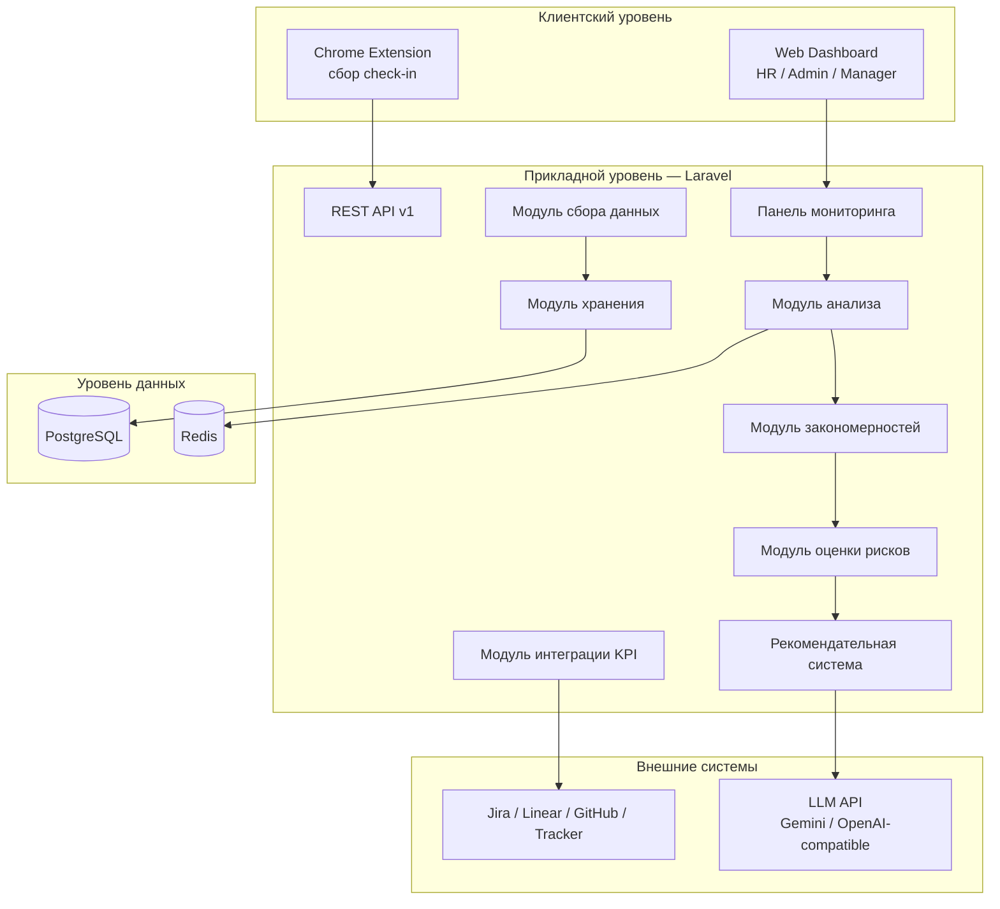
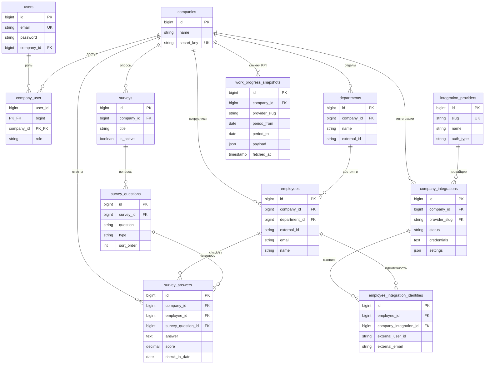
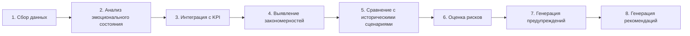
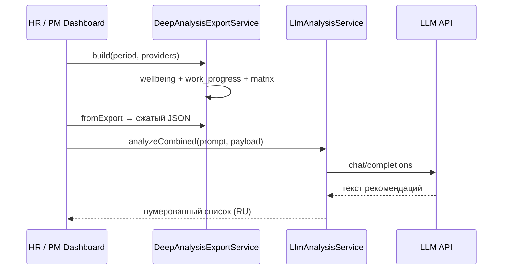

# Глава 3. Проектирование системы

**Проект:** Wellbeing Monitor — платформа мониторинга психологического состояния удалённых сотрудников с интеграцией метрик задач (KPI delivery) и рекомендациями на основе LLM.

Документ описывает проектные решения в соответствии с реализованным MVP (Laravel 12, PostgreSQL, Redis, Chrome Extension, интеграции Jira / Linear / GitHub Issues / Яндекс Трекер). Отдельно отмечены элементы, заложенные в архитектуру как перспектива развития.

---

## 3.1 Концепция сбора эмоциональных данных

### Назначение

Система собирает **регулярные сигналы о самочувствии** сотрудников без тяжёлых опросов и без доступа к личной переписке или экрану. Цель — раннее выявление стресса, снижения вовлечённости и риска выгорания на уровне человека, отдела и компании.

### Микроопросы (check-in)

Основной канал — **ежедневный микроопрос** через браузерное расширение (Chrome MV3):

| № | Тема | Тип данных | Шкала / формат |
|---|------|------------|----------------|
| 1 | Общее настроение | Количественный сигнал | Шкала 1–5 |
| 2 | Уровень стресса | Количественный сигнал | Шкала 1–5 |
| 3 | Поддержка команды | Качественный / бинарный | Да / Нет |
| 4 | Комментарий | Текст (опционально) | Свободный ввод |

**Принципы:**

- **Короткий цикл** — 1–2 минуты, один check-in на календарный день на сотрудника.
- **Идентификация** — сотрудник не регистрируется на портале; используется `secret_key` компании (48 символов) и внешний `external_id` (например `emp-001`). При первом ответе запись сотрудника создаётся автоматически.
- **Нормализация** — ответы сохраняются в `survey_answers` с полем `score` (числовая оценка для шкал) и `check_in_date` для агрегации по периодам.
- **Изоляция tenant** — все записи привязаны к `company_id`; данные одной организации недоступны другой.

### Текстовые комментарии

Четвёртый вопрос опроса даёт **качественный контекст** (свободный текст). В текущей реализации:

- комментарии хранятся в `survey_answers.answer` наравне с остальными ответами;
- при агрегации для дашборда и LLM в первую очередь используются **числовые метрики** (среднее настроение, стресс, доля «да» по поддержке);
- полный текст комментариев передаётся в LLM только в режиме **полного экспорта** (`?full=1`); для глубокого анализа в LLM уходит сжатая матрица без сырых check-in.

Перспектива развития: отдельный подмодуль **анализа тональности (sentiment)** комментариев с помощью NLP/LLM без изменения UX сбора.

### Дополнительные источники (не эмоции, а KPI)

Для сопоставления «самочувствие ↔ нагрузка» подключаются **внешние трекеры задач** (Jira Cloud и др.). Это не эмоциональные данные, но они входят в единый контур анализа на этапе **глубокого анализа** (см. п. 3.2).

---

## 3.2 Общая архитектура системы

### Уровни системы



### Описание основных компонентов

| Компонент | Назначение | Реализация в проекте |
|-----------|------------|----------------------|
| **Модуль сбора данных** | Приём check-in от расширения, валидация, привязка к компании и сотруднику | `CheckInService`, API `POST /api/v1/extension/check-in`, расширение Chrome |
| **Модуль анализа эмоций** | Расчёт средних показателей, трендов, агрегация ответов по дням и сотрудникам | `AnalyticsService`, `AnalyticsRepository`, `AnswerScoreCalculator` |
| **Модуль хранения данных** | Персистентное хранение сущностей, снимков KPI, шифрование credentials | PostgreSQL, Eloquent-модели, `WorkProgressSnapshot`, шифрование `company_integrations.credentials` |
| **Модуль интеграции KPI** | Синхронизация метрик задач из трекеров, маппинг assignee → сотрудник | `IntegrationManager`, коннекторы (`JiraCloudConnector` и др.), `WorkProgressAggregator` |
| **Модуль выявления закономерностей** | Сопоставление wellbeing и delivery, сводная матрица по сотрудникам | `DeepAnalysisEmployeeMatrixBuilder`, `employee_delivery_matrix` |
| **Модуль прогнозирования рисков** | Оценка уровня риска выгорания по правилам и трендам | `BurnoutRiskService`, enum `BurnoutRiskLevel` (low / medium / high) |
| **Рекомендательная система** | Генерация текстовых рекомендаций для HR/PM по ролевым промптам | `LlmAnalysisService`, каталоги `analysis_prompts`, `deep_analysis_prompts` |
| **Панель мониторинга** | Визуализация метрик, настройка интеграций, запуск анализа | Blade-дашборд: `/dashboard`, `/dashboard/analysis`, `/dashboard/deep-analysis`, `/dashboard/integrations` |

### Инфраструктура

- **Docker:** Nginx, PHP-FPM, PostgreSQL 16, Redis (кэш, сессии, очереди).
- **Фоновые задачи:** `ProcessCheckInAnalyticsJob`, `GenerateWeeklySummaryJob` (очередь Redis).
- **Безопасность:** multi-tenant по `company_id`, роли пользователей (`admin`, `hr`, `manager`), API расширения по `secret_key`.

---

## 3.3 Логическая модель данных

### ER-обзор (ядро + интеграции)

*Рисунок 3.1 — логическая модель данных Wellbeing Monitor (PostgreSQL). Откройте preview Markdown (Ctrl+Shift+V) или [mermaid.live](https://mermaid.live).*



**Условные обозначения:** `PK` — первичный ключ, `FK` — внешний ключ, `UK` — уникальное поле. Снимок `work_progress_snapshots.payload` хранит агрегированные KPI (задачи, просрочки) за период; риск-профиль и рекомендации в БД не сохраняются (вычисляются / генерируются при запросе).

### Основные сущности

#### Пользователи

| Сущность | Описание | Ключевые атрибуты |
|----------|----------|-------------------|
| **User** | HR / Admin / Manager веб-дашборда | `email`, `password`, роль в pivot `company_user` |
| **Employee** | Участник микроопросов (не логинится на сайт) | `external_id`, `email`, `name`, `department_id`, `company_id` |
| **Company** | Организация-клиент (tenant) | `name`, `secret_key` |

Сотрудник и пользователь дашборда — **разные роли**: сбор данных идёт через расширение, анализ — через веб-интерфейс.

#### Эмоциональные сигналы

Логически — агрегат ответов check-in за период; физически — строки **`survey_answers`**:

- `score` — нормализованная числовая оценка (настроение, стресс);
- `answer` — текст или значение «yes»/«no»;
- `check_in_date` — дата сигнала;
- связь с `survey_question_id` (тип вопроса: scale / boolean / text).

На уровне аналитики формируются производные показатели: `avg_mood`, `avg_stress`, `team_support_yes_rate`, тренд по дням.

#### KPI (метрики delivery)

Логическая сущность **KPI сотрудника за период** материализуется в:

1. **Снимке** `work_progress_snapshots.payload` (JSON: задачи закрыты/созданы/просрочены, ключи issue, статусы);
2. **Агрегате** в `work_progress.employees[]` после `WorkProgressAggregator`;
3. **Строке матрицы** `employee_delivery_matrix[].tasks` для LLM.

Примеры KPI: `tasks_closed`, `tasks_created`, `overdue_count`, `tasks_open`, `avg_resolution_days`, список `overdue_issues`.

#### Риск-профили

Отдельная таблица **не используется** — риск-профиль вычисляется **на лету** сервисом `BurnoutRiskService` и возвращается в API аналитики:

```json
{
  "level": "medium",
  "label": "Medium risk",
  "current_average": 3.1,
  "previous_average": 3.6,
  "trend": "declining"
}
```

Критерии: пороги среднего настроения за 7 дней, сравнение с предыдущей неделей, признак падения ≥ 0.3 балла.

*Перспектива:* таблица `risk_profiles` с историей снимков и привязкой к сценариям (п. 3.5).

#### Предупреждения

Логические предупреждения формируются на этапе экспорта и синхронизации:

- отсутствие снимка трекера за период;
- немаппленные assignee в Jira (`unmapped_assignees`);
- ошибки интеграции (`integration_warnings`, `last_error` у `company_integrations`).

В UI отображаются как предупреждения; **отдельная сущность Alert в БД** — в перспективе.

#### Рекомендации

Рекомендации **не персистируются** в MVP: результат вызова LLM возвращается клиенту (нумерованный список на русском). Вход: сжатый JSON (`DeepAnalysisLlmPayloadBuilder`) + системный промпт роли (психолог, HR, product owner и т.д.).

*Перспектива:* таблица `recommendations` (company_id, period, prompt_id, text, created_at).

### Справочники интеграций

- `integration_providers` — Jira, Linear, GitHub Issues, Яндекс Трекер;
- `company_integrations` — подключение компании, зашифрованные credentials;
- `employee_integration_identities` — явный маппинг сотрудник ↔ пользователь трекера (дополнение к маппингу по email).

---

## 3.4 Алгоритм обработки данных

### Общая схема pipeline



### Этапы (детализация)

| Этап | Вход | Обработка | Выход |
|------|------|-----------|--------|
| **1. Сбор данных** | Ответы расширения, webhook/API трекеров | Валидация, upsert сотрудника, запись `survey_answers`; sync Jira → snapshot | Сырые ответы, `work_progress_snapshots` |
| **2. Анализ эмоционального состояния** | `survey_answers` за период | Группировка по сотруднику/дню, расчёт средних, трендов | `AnalyticsService::getOverview`, экспорт wellbeing |
| **3. Интеграция с KPI** | Snapshot + справочник сотрудников | JQL-поиск задач, агрегация по assignee, merge провайдеров, маппинг по email | `work_progress`, предупреждения о немаппленных |
| **4. Выявление закономерностей** | wellbeing + work_progress | `DeepAnalysisEmployeeMatrixBuilder` — одна строка на человека | `employee_delivery_matrix` |
| **5. Сравнение с историческими сценариями** | Текущий период vs прошлый | В MVP: сравнение среднего настроения неделя к неделе (`BurnoutRiskService`); в deep analysis — контекст периода в промпте LLM | Тренд improving / declining / stable |
| **6. Оценка рисков** | Агрегаты настроения, KPI | Пороговые правила → `BurnoutRiskLevel`; для delivery — просрочки + низкий mood в матрице | Риск-профиль (вычисляемый) |
| **7. Генерация предупреждений** | Результаты sync и merge | Список `integration_warnings`, немаппленные assignee | Сообщения в UI / JSON preview |
| **8. Генерация рекомендаций** | Сжатый JSON + role prompt | `LlmAnalysisService::analyze` / `analyzeCombined` | 3–6 пунктов рекомендаций на русском |

### Два режима анализа

1. **Базовый анализ** (`/dashboard/analysis`) — только wellbeing, промпты: психолог, HR-аналитик, руководитель.
2. **Глубокий анализ** (`/dashboard/deep-analysis`) — wellbeing + KPI: синхронизация трекеров → матрица → LLM (product owner, HR+delivery, team lead).

### Оптимизация объёма данных для LLM

Чтобы снизить нагрузку на API и повысить устойчивость:

- в LLM передаётся **сжатый payload** (`DeepAnalysisLlmPayloadBuilder`): матрица + сводки, без сырых `check_ins` и полных списков `open_issues` / `closed_issues`;
- ключи просроченных задач ограничиваются (`LLM_DEEP_ANALYSIS_MAX_OVERDUE_KEYS`, по умолчанию 10).

---

## 3.5 Механизм формирования риск-профилей

### Цель

Дать HR и руководителю **быструю количественную оценку** риска выгорания без ожидания ответа LLM.

### Выявление исторических паттернов

В текущей версии используется **укороченный временной паттерн**:

- **текущее окно:** последние 7 календарных дней — среднее настроение `current_average`;
- **предыдущее окно:** дни 8–14 назад — `previous_average`;
- **тренд:** разница ≥ 0.2 → `improving` / `declining` / иначе `stable`.

```text
IF current_average < 2.5        → High
ELSE IF current < 3.5 AND падение ≥ 0.3 от previous → Medium
ELSE IF current < 3.0           → Medium
ELSE                            → Low
```

Данных для полноценного **кластерного анализа** или ML-модели в MVP нет; закладывается расширение за счёт накопления снимков риска в БД.

### Определение критических значений

| Показатель | Критический порог (реализация) | Интерпретация |
|------------|-------------------------------|---------------|
| Среднее настроение (7 дн.) | &lt; 2.5 | Высокий риск |
| Среднее настроение | &lt; 3.0 | Средний риск |
| Падение к прошлой неделе | ≥ 0.3 при mood &lt; 3.5 | Средний риск (ухудшение) |
| Просроченные задачи (deep analysis) | `overdue_count` &gt; 0 + низкий `avg_mood` | Сигнал для LLM и HR (качественно) |

Пороги зафиксированы в коде `BurnoutRiskService` и могут быть вынесены в конфигурацию компании.

### Оценка степени сходства сценариев

**Целевая модель (проект):** библиотека эталонных сценариев («падение mood + рост overdue», «стабильный стресс без поддержки команды») и метрика сходства (косинусное расстояние по вектору признаков или правила IF-THEN).

**Реализация MVP:** сходство с сценарием делегировано **LLM** в глубоком анализе — модель сопоставляет числа из `employee_delivery_matrix` с формулировками в промпте; формальный scoring сценариев не реализован.

---

## 3.6 Механизм формирования рекомендаций

### Архитектура рекомендательной подсистемы



### Правила формирования рекомендаций

Задаются **системным промптом роли** + общими ограничениями из `config/llm.php`:

1. Только **нумерованный список** на русском (3–6 пунктов).
2. Каждый пункт — **одно законченное предложение**.
3. Запрещены выдуманные метрики; для deep analysis — **обязательны цифры и имена** из `employee_delivery_matrix`.
4. При просрочках — указание **ключей задач** из `overdue_issues` (если есть в JSON).
5. Без markdown, вступлений, медицинских диагнозов.

Постобработка: `LlmAnalysisService::normalizeRecommendation` — удаление markdown, приведение к единому нумерованному формату.

### Категории рекомендаций

| Каталог | Роли / промпты | Фокус |
|---------|----------------|-------|
| `analysis_prompts` | Психолог, HR-аналитик, Руководитель | Wellbeing, климат, удержание |
| `deep_analysis_prompts` | Product owner, HR+delivery, Team lead | Wellbeing + KPI задач |

Категории соответствуют **задачам стейкхолдера**, а не жёсткой таксономии в БД.

### Приоритизация действий

| Уровень | Механизм в MVP | Пример |
|---------|----------------|--------|
| **Неявный (LLM)** | Порядок пунктов в ответе модели; промпт просит «top-3» / «срочные 1:1» | «Сначала 1:1 с X (avg_mood 2.1, 3 просрочки KAN-12…)» |
| **Явный (риск)** | `BurnoutRiskLevel::High` на дашборде | Визуальный акцент до запроса LLM |
| **Перспектива** | Поле `priority` (critical / high / medium), scoring = f(risk, overdue, trend) | Сортировка рекомендаций в UI |

### Ограничения и отказоустойчивость

- При недоступности LLM (HTTP 503, лимиты провайдера) пользователь получает сообщение об ошибке; повторный запрос вручную.
- Тарифные лимиты заложены в `PlanLimitService` (deep analysis) — enforcement по плану компании в развитии.

---

## Связь с реализацией (справочно)

| Раздел отчёта | Ключевые файлы / маршруты |
|---------------|---------------------------|
| Сбор | `CheckInService`, `routes/api.php`, Chrome Extension |
| Аналитика | `AnalyticsService`, `BurnoutRiskService` |
| KPI | `JiraCloudConnector`, `IntegrationManager`, `WorkProgressAggregator` |
| Матрица | `DeepAnalysisEmployeeMatrixBuilder` |
| LLM | `LlmAnalysisService`, `DeepAnalysisLlmPayloadBuilder` |
| UI | `resources/views/dashboard/*`, `DeepAnalysisController` |

---

*Документ подготовлен для включения в пояснительную записку / отчёт по курсовому проекту. При расхождении с кодом приоритет имеет репозиторий `wellbeing-monitor` (ветка main).*
